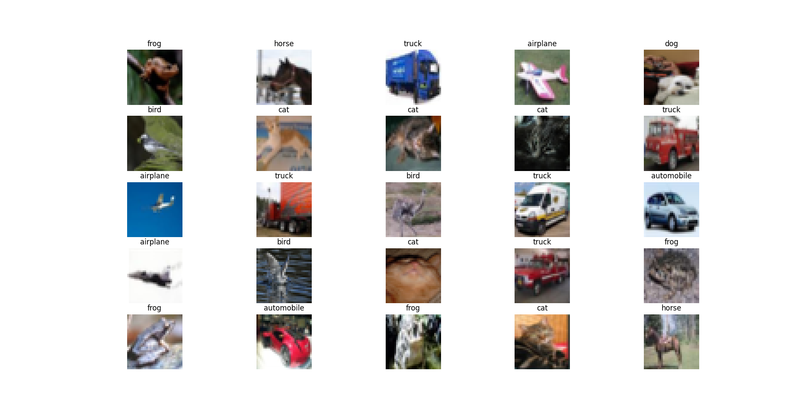
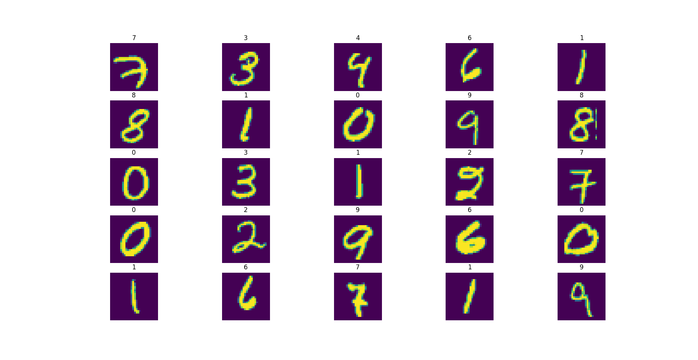
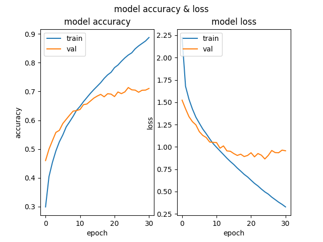
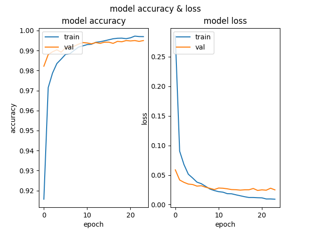

# AlexNet for cifar10 and mnist

The [AlexNet CNN architecture](https://homl.info/80) won the 2012 ImageNet ILSVRC challenge by a large margin. It is similar to [LeNet-5](https://homl.info/lenet5), with much larger and deeper architecture. In this project, I reimplemented the AlexNet CNN architecture on the mnist and cifar10 datasets, achieving the perfect results below.

  
  
  
  

## architecture

<table border="0">
 <tr>
    <td><b style="font-size:30px">cifar10 dataset</b></td>
    <td><b style="font-size:30px">mnist dataset</b></td>
 </tr>
 <tr>
    <td>
        <pre>
_________________________________________________________________
Layer (type)                 Output Shape              Param #   
=================================================================
conv2d (Conv2D)              (None, 54, 54, 96)        34944     
_________________________________________________________________
batch_normalization (BatchNo (None, 54, 54, 96)        384       
_________________________________________________________________
max_pooling2d (MaxPooling2D) (None, 26, 26, 96)        0         
_________________________________________________________________
conv2d_1 (Conv2D)            (None, 26, 26, 256)       614656    
_________________________________________________________________
batch_normalization_1 (Batch (None, 26, 26, 256)       1024      
_________________________________________________________________
max_pooling2d_1 (MaxPooling2 (None, 12, 12, 256)       0         
_________________________________________________________________
conv2d_2 (Conv2D)            (None, 12, 12, 384)       885120    
_________________________________________________________________
batch_normalization_2 (Batch (None, 12, 12, 384)       1536      
_________________________________________________________________
conv2d_3 (Conv2D)            (None, 12, 12, 384)       1327488   
_________________________________________________________________
batch_normalization_3 (Batch (None, 12, 12, 384)       1536      
_________________________________________________________________
conv2d_4 (Conv2D)            (None, 12, 12, 256)       884992    
_________________________________________________________________
batch_normalization_4 (Batch (None, 12, 12, 256)       1024      
_________________________________________________________________
max_pooling2d_2 (MaxPooling2 (None, 5, 5, 256)         0         
_________________________________________________________________
flatten (Flatten)            (None, 6400)              0         
_________________________________________________________________
dense (Dense)                (None, 4096)              26218496  
_________________________________________________________________
dropout (Dropout)            (None, 4096)              0         
_________________________________________________________________
dense_1 (Dense)              (None, 4096)              16781312  
_________________________________________________________________
dropout_1 (Dropout)          (None, 4096)              0         
_________________________________________________________________
dense_2 (Dense)              (None, 10)                40970     
=================================================================
Total params: 46,793,482
Trainable params: 46,790,730
Non-trainable params: 2,752
_________________________________________________________________
        </pre>
    </td>
    <td>
        <pre>
_________________________________________________________________
Layer (type)                 Output Shape              Param #   
=================================================================
conv2d (Conv2D)              (None, 54, 54, 96)        11712     
_________________________________________________________________
batch_normalization (BatchNo (None, 54, 54, 96)        384       
_________________________________________________________________
max_pooling2d (MaxPooling2D) (None, 26, 26, 96)        0         
_________________________________________________________________
conv2d_1 (Conv2D)            (None, 26, 26, 256)       614656    
_________________________________________________________________
batch_normalization_1 (Batch (None, 26, 26, 256)       1024      
_________________________________________________________________
max_pooling2d_1 (MaxPooling2 (None, 12, 12, 256)       0         
_________________________________________________________________
conv2d_2 (Conv2D)            (None, 12, 12, 384)       885120    
_________________________________________________________________
batch_normalization_2 (Batch (None, 12, 12, 384)       1536      
_________________________________________________________________
conv2d_3 (Conv2D)            (None, 12, 12, 384)       1327488   
_________________________________________________________________
batch_normalization_3 (Batch (None, 12, 12, 384)       1536      
_________________________________________________________________
conv2d_4 (Conv2D)            (None, 12, 12, 256)       884992    
_________________________________________________________________
batch_normalization_4 (Batch (None, 12, 12, 256)       1024      
_________________________________________________________________
max_pooling2d_2 (MaxPooling2 (None, 5, 5, 256)         0         
_________________________________________________________________
flatten (Flatten)            (None, 6400)              0         
_________________________________________________________________
dense (Dense)                (None, 4096)              26218496  
_________________________________________________________________
dropout (Dropout)            (None, 4096)              0         
_________________________________________________________________
dense_1 (Dense)              (None, 4096)              16781312  
_________________________________________________________________
dropout_1 (Dropout)          (None, 4096)              0         
_________________________________________________________________
dense_2 (Dense)              (None, 10)                40970     
=================================================================
Total params: 46,770,250
Trainable params: 46,767,498
Non-trainable params: 2,752
_______________________________________________________
        </pre>
    </td>
 </tr>
</table>

## Results

  
  
  
  

